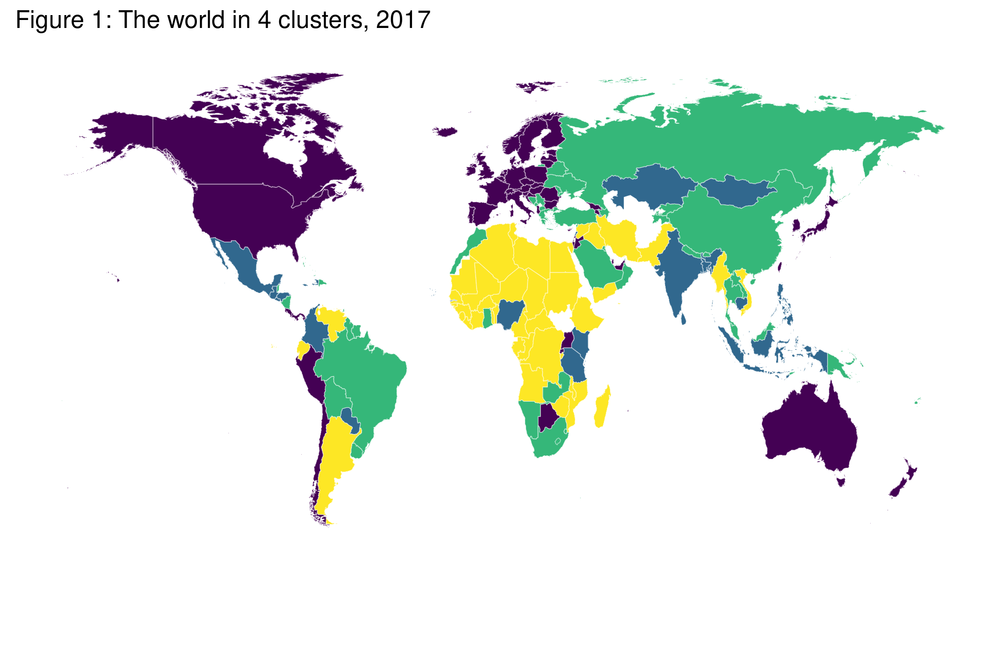
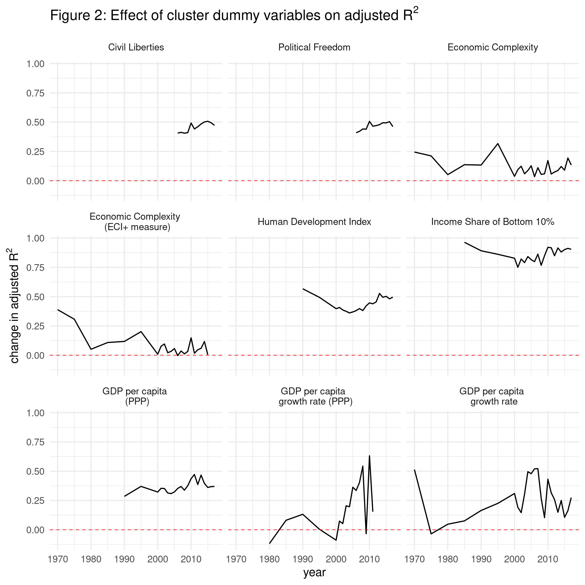

```{r setup, include=FALSE}
knitr::opts_chunk$set(echo = TRUE)
source("script0.R")

```

## Abstract
This study creates a novel data set using the information contained in the Economic Freedom of the World (EFW) index. The five sub-indices of the EFW indices are used to cluster countries, creating qualitative measures that provide information implicit in the index but inadequately captured by index itself.

The clusters show that countries fall into groups that only imperfectly align with the overall score. Noteably, performance on Area 1 of the EFW index ("Size of Government") appears less important than other areas for distinguishing countries by based on their degree of market liberalism.

The explanatory power of cluster variables is explored by adding them to regressions on a variety of outcome variables. Adding cluster membership to these regressions approximately doubles the portion of variance explained relative to models using the EFW index alone.

## Introduction

The connection between effective institutions and positive economic outcomes is well established [@EFW2019; @HALLLAWSON2014]. Economies suffer in countries lacking rule of law, responsible monetary policy, free trade, effective courts, etc. However, complex interactions and bi-directional causality make aggregate analysis difficult and limit the usefullness of linear regressions.

Institutions matter. Incentives drive economic behavior and those incentives are shaped by the rules of a society. Studying those rules is an important task for economists who want to understand the sources of economic growth and other important outcomes. An important project in studying institutions is the Economic Freedom of the World (EFW) index [@EFW2019].

The EFW index attempts to quantify the extent to which different countries have liberalized their economy. It aggregates a wide range of data to construct an index on a 0 to 10 scale (with higher scores reflecting a greater degree of economic freedom). The overall index is an average of five sub-indices: i) size of government (i.e. the degree to which production occurs in the private sector), ii) legal system and property rights, iii) sound money, iv) freedom to trade internationally, and v) regulation.

A survey of papers using EFW has found that "the balance of evidence is overwhelming that economic freedom corresponds with a wide variety of positive outcomes with almost no negative tradeoffs." [@HALLLAWSON2014] Roughly speaking, free countries outperform unfree countries.

The EFW index is a linear variable, but the effects of economic freedom and its components may be non-linear. This paper investigates such a possibility with a hierarchical clustering model of the EFW data broken down by sub-index. Countries are grouped by their similarity to one another within this five dimensional "institution space". Rather than dividing the world between more- and less-free, this study attempts to find groupings that reflect the *sorts* of freedom present in different countries.

By grouping countries with similar institutional features we change the question from "what is the marginal importance of economic freedom?" to "what *combinations* of institutional traits are important?" Robert Lawson [-@Lawson2006] has argued that attempting to ask which EFW component is most important "is like asking what the most important ingredient is in a cherry pie." A clustering approach is analagous to reframing the question as "what ratio of shortening to flour is best?" In fact, clustering has been used (informally) to ask just such questions about margarita recipes [@hickeysilverlaskowskichow2017].

Machine learning methods are increasingly accessible and offer new research frontiers for economists [@varian2014machine]. Such techniques have made little headway into the EFW literature. An early exception is Huskinson and Lawson's exercise in clustering countries according to their EFW sub-index scores [@huskinson2014clusters]. This paper updates their findings and uses an improved methodology.

A technical appendix is available at https://github.com/RickWeber/EFW_clustering. It includes all of the code necessary for replicating the results presented here, as well as details excluded due to constrained space. The rest of the paper proceeds as follows: the clustering algorithms used by Huskinson and Lawson are explained, then stylized facts are presented regarding the clusters calculated for the latest available data, regressions using the cluster variables are compared to regressions using EFW alone, and finally conclusions are drawn

## Method

Clustering algorithms are a set of unsupervized machine learning methods--we do not know in advance what clusters each country belongs to. The algorithms use normalized data to group countries based on how close they are to one another in the five dimensional space defined by the EFW sub-indices.

This exercise is largely motivated by an earlier attempt to cluster countries based on economic [@huskinson2014clusters]. That paper uses K-means clustering to create 4 groups of countries based on their scores on the five EFW sub-indices using 2010 data. Huskinson and Lawson named their clusters “based on a subjective evaluation of each cluster’s economic type”: Liberal market, Social Democratic Market, Poorly governed Market, and State dominated. 

The k-means approach is simple and intuitive. However, it has shortcomings addressed here by using hierarchical clustering. An intuitive understanding of the K-means approach will be useful for understanding the hierarchical clustering method and its advantages over the K-means approach.

First, a number of clusters, K, is chosen. K different points are selected randomly and placed within the multi-dimensional space occupied by the data set in question. Each observation in the data set is then assigned to whichever cluster center it is closest to (usually defined by Euclidean distance). The cluster centers are then recalculated based on the members of each cluster. With the new centers, observations are re-assigned to whichever cluster centroid is closest. The algorithm keeps iterating this way until a stable set of clusters is achieved [@macqueen1967some].

This paper uses hierarchical clustering. Instead of starting with a pre-defined value of k, this method iteratively combines sub-clusters into larger clusters. Starting with *n* observations in *n* "clusters", the two closest clusters are combined into a new cluster (resulting in *n-1* clusters). This process continues until all clusters are finally combined into one. This approach generates as many clusters as desired.

There are a variety of ways to define how close two clusters are. This paper uses the Ward Criterion which assigns members to clusters in order to minimize within-cluster variance. Deciding the number of clusters is largely a matter of judgement on the part of a researcher. The technical appendix includes a bootstrapping exercise comparing performance on different measures of cluster coherence for both hierarchical and k-means clustering. The results weakly indicate that a larger number of clusters fit the data. This paper errs on the side of interpretability as well as folling Huskinson and Lawson by choosing to divide the data into four clusters. 

As can be seen in the technical appendix, the data is first normalized so each dimension has a mean of 0 and standard deviation of 1. This pre-processing step ensures that no one-dimension dominates the separation of observations. For example, if one were clustering housing data including number of bedrooms, number of bathrooms, and price, the impact of price would dominate the calculation of difference between two houses. Price differences of thousands of dollars would swamp the comparisons making five bedroom houses look relatively similar to one bedroom houses. 

Given that the initial data is already on a 0-10 scale, one could skip this normalizing step. Doing so will yield different cluster membership--most notably, much of Europe ends up in a different cluster than in the scaled version. However, the linear regressions using cluster membership experience a similar performance gain to that discussed below. 

## Stylized facts

Clustering the normalized 2017 data into four clusters results in groupings that imperfectly align with the overall EFW scores. As shown in Figure 1, the wealthiest countries cluster together (e.g. United States, much of Europe, Japan, and more). Much of Africa, and the Middle East cluster together (along with Venezuela). 



Table 1 shows that the cluster with the highest scores for the "Size of Government"subindex (Cluster 2) are outperformed on the other subindices by Cluster 1 whose average score for "Size of Government" is substantially lower. 

```{r table1, echo=FALSE}
clustered_data_2017 %>% 
  rename(Cluster=cluster) %>%
  group_by(Cluster) %>% 
  summarize_if(is.double,mean,na.rm=TRUE) %>% 
  flextable() %>%
  valign(valign = "top", part = "header") %>%
  align(align = "center", part = "header") %>%
  align(align = "center", part = "body") %>%
  colformat_num(digits = 3, j = 2:7) %>% 
  add_header_lines(values="Table 1: Mean values of normalized EFW scores by cluster")
```

Cluster 1 (which includes the United States) has 56 members.
It's average overall EFW score is approximately 1 standard deviation above the world mean. However, it's mean area 1 (size of government) score is slightly below 0. 
This cluster roughly corresponds with Huskinson and Lawson's  "Social democratic market" cluster. It is characterized by relatively large government, but strong property rights, free trade, sound monetary institutions, and relatively market friendly regulatory frameworks.

Cluster 2 has 22 members. This cluster has small governments, but is otherwise less liberalized than Cluster 1. It includes Russia, Mexico, Turkey, and The Philippines. It roughly corresponds with "Poorly governed markets".

Cluster 3 has 44 members including China, Brazil, and Greece. This cluster has larger governments on average and performs around, or below average on all five EFW sub-indices.

Cluster 4 (which includes Venezuela, the lowest ranked country, and much of central Africa and the Middle East) has 40 members. With the exception of area 1, the average score for each sub index is approximately one or more standard deviations below the world average for 2017. 


It appears that, on average, large government can be positively correlated with market friendly institutions. This provides support for the hypothesis that state capacity [@CITATIONCOWEN] is an important ingredient in a successful society. Although it is possible that large government is a normal good--this argument is beyond the scope of this paper.

## Performance of clustering variables

```{r table2, echo=FALSE}
table_names <- list("measure",
   bquote('change in adjusted R'^2),
   bquote('Baseline model adjusted R'^2),
   bquote('Dummy model adjusted R'^2))
# comp_sum
comp_sum %>% 
flextable() %>%
  valign(valign = "top", part = "header") %>%
  align(align = "center", part = "header") %>%
  align(align = "center", part = "body") %>%
  colformat_num(digits = 3, j = 2:4) %>% 
  compose(part="header",j="adj.r.squared1",
          value = as_paragraph("Baseline model adjusted R", as_sup("2"))) %>% 
  compose(part="header",j="adj.r.squared2",
          value = as_paragraph("Dummy model adjusted R", as_sup("2"))) %>% 
  compose(part="header",j="gain",
          value = as_paragraph("Change in adjusted R", as_sup("2"))) %>% 
  add_header_lines(values="Table 2: Model performance metrics")
```

To evaluate the dummy variables created via clustering, the adjusted $R^2$ of two models will be compared:

Model 1:
$y = \beta_0 + \beta_1 EFW$

Model 2:
$y = \beta_0 + \beta_1 EFW + \beta_2 cluster$

The baseline model regresses the scaled overall EFW score on a variable of interest. This paper uses 9 variables reflecting political liberties [@FH2020], economic complexity [@eci], the UN's Human Development Index [@hdi], per capita GDP and economic growth, and the share of income going to the bottom 10% of a country's income distribution [accessed via the World Bank's API using @wbstats]. The comparison model adds a dummy variable for each of the four clusters. These regressions are created for all years for which data is available (with clusters calculated separately for each year).


There are 171 comparisons being made between regressions on 9 variables across nearly 50 years. Not all variables are available for all years. The gain in adjusted R2 is greater than 0 in all but 5 of those regressions. The mean increase is 0.3462 and the median increase is 0.3612. This is from a mean adjusted R2 in Model 1 of approximately 0.27. Cluster membership roughly doubles the explanatory power of the EFW score itself. Clus---
ter membership clearly adds a great deal of information that is not available in the EFW score itself.

The biggest gains were to the income share of the bottom 10% of the income distribution (a mean gain in adjusted R2 of 0.86), and the smallest were to economic complexity (a mean gain of approximately 0.1 depending on the eci measure used). 



## Conclusion

This article confirms Huskinson and Lawson's (2014) conclusion, "that the groupings of countries from the one-dimensional EFW index are different from those we would get if using the multidimensional information found at the EFW area [sub-index] level." While the overall EFW score does a reasonably good job of comparing very free countries to very unfree countries this study demonstrates that it can be improved upon. Clustering allows one to account for differences in the particular combinations of institutional traits. These institutional clusters provide new information beyond that embedded in the one-dimensional EFW scores. 

The interested reader is encouraged to explore the technical appendix. It includes pre-compiled data for all available years, with clusters defined at all levels from 2 to 12 clusters, using hierarchical and k-means algorithms. Additionally, all the code used in this project is available for replication and modification.

## Acknowledgements

The author wishes to thanks colleagues at the Farmingdale State College Economics Review Seminars as well as participants at the Academy of Economics and Finance for helpful comments. The usual caveat applies.
<!-- Hope is had by the author that anonymous reviewer number two finds sufficiently satisfying the increased use of the passive voice and unnaturally formal language. They may be thanked for stylistic improvements from the original submission. I genuinely thank them for their comments that helped evaluating the outcome of this project. -->

## References
